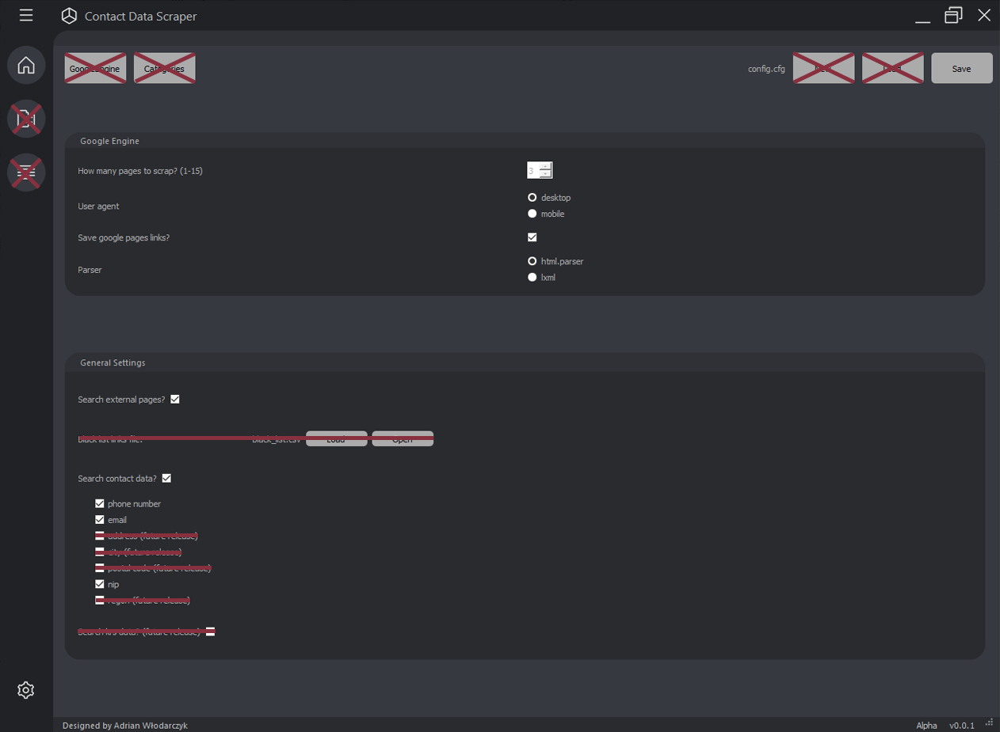

# Contact Data Scraper
This is Windows application with User Interface that helps you to find websites and contact information to companies.
## Installation
You need to have installed python 3.x and pip package.\
Open command line and go to the directory you want to clone repository (copy project)\
After that insert following commands.
```bash
git clone https://github.com/xandis520/ContactDataScraper

pip install -r requirements.txt
```
## Run
In command line type
```bash
python main.py
```
## Settings
### Google engine settings:
#### How many pages to scrap?
For one google page, there is about 10 external links. In 15 google pages you can find max 150 external links.
#### User agent
This is heading which application will send to website service.\
Desktop - website will send content personalized to desktop device.\
Mobile - website will send content personalized to mobile device.
#### Save google pages links?
App asks us if we want to save google internal links to next pages.
#### Parser
Program that is responsible for the analysis of website content. "html.parser" is slower and more accurate. "lxml" is faster and less accurate.
### General settings:
#### Search external pages?
Do you want search and save external links found in google pages?
### Search contact data?
Do you want to search and save specified contact data found inside external links?
Currently available: phone number (Polish mobile number type), email, nip


## How it works
Only thing you have to do is to configure settings and after that insert phrase and click run.
Files will be saved in "links" directory.
## License